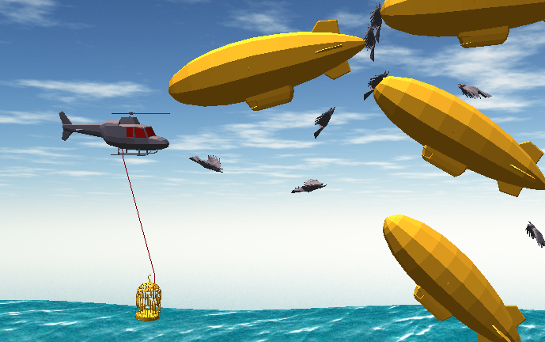
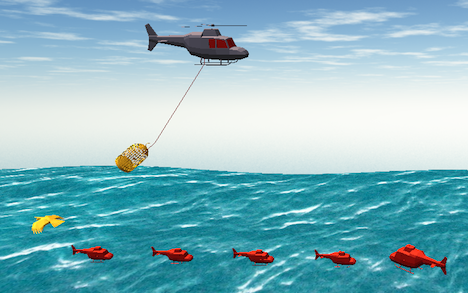

# 

## How to Play

  

### Player One (Helicopter)
* Use the `WASD` keys to move.
* Swing the cage into a grey bird to capture it.
* Avoid the golden blimps, or you'll lose a life!
### Player Two (Golden Bird)
* Use the `Arrow Keys` to move
* Spawn at the cage at the cost of one 'bird ammo.'
* Crash into a blimp to score a point.
* Protect player one!

  

